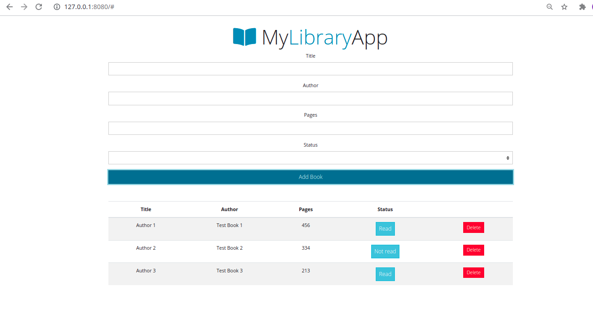

# LIBRARY

This is a javascript project that allows users to add books, delete books, change the reading status. Users can also track how many books are there in the library.
In this project, we developed a simple javascript library application that includes:

- The form uses Bootstrap library for css combined with javascript code
- User can add books to library with the author's name, book title, page numbers and reading status.
- User can delete book from the library.

## Built With

- Javascript
- Bootstrap
- ESLINT

## Getting Started

To get a local copy up and running follow these simple example steps:

### Prerequisite

To get a local copy of the repository please run the following commands on your terminal:

- cd <folder>
- git clone <a href="https://github.com/Alaska01/Library-App">https://github.com/Alaska01/Library-App</a>
- Open the index.html file using your browser

## Live version

<a href="https://aye-library-app.netlify.app/" target="_blank">Click here</a>

## Author

👤 **Aye Daniel Asoo**

# Author's Social Media Handle's

- Github: [Github](https://github.com/Alaska01)
- Twitter: [Twitter](https://twitter.com/AyeAsoo)
- E-mail: <a href="mailto:aadaniel108@gmail.com?subject=Hello Daniel!">Email</a>
- Linkedin: [Linkedin](https://www.linkedin.com/in/daniel-asoo-aye/)

## 🤝 Contributing

Contributions, issues and feature requests are welcome!

Feel free to check the [issues page](https://github.com/Alaska01/Library-App/issues).

## Show your support

Give a ⭐️ if you like this project!

## Acknowledgments

- Google

## 📝 License

This project is [MIT](lic.url) licensed.
{"mode":"full","isActive":false}
